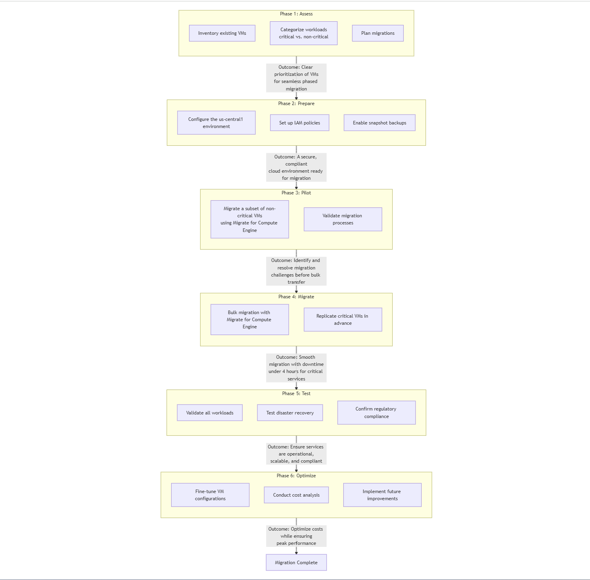

# Comprehensive Plan for Migrating 150 VMs to Google Cloud

This detailed strategy focuses on migrating **150 Windows and Linux VMs** to Google Cloud while addressing the following challenges:

1.  **Rising operational costs** in order to maintain the on-premises data centers.
2.  **Scalability and disaster recovery** to support future growth.
3.  **Compliance with international regulations** following compliance like GDPR, HIPAA.
4.  **Downtime limit** less than 4 hours for the critical services.

The plan avoids unnecessary complexity by focusing on **Google Compute Engine** and avoiding services like Cloud CDN or Load Balancing unless they are required.

**Challenges and Solutions**

| **Challenge**       | **Proposed Solution**                                                                                                                                          |
|---------------------|---------------------------------------------------------------------------------------------------------------------------------------------------------------|
| **Rising Operational Costs** | In ordert to reduce maintainence and infrastructure cost, therefore by transitioning from on-premises to a centralized Google Cloud region .                                      |
| **Scalability & Disaster Recovery** | By using **regional snapshots** for VM backups and failover, and also allowing high availability and fast recovery.                                          |
| **Compliance**      | Applying **Cloud IAM** to access control and **Cloud KMS** for the data encryption, ensure compliance with GDPR and HIPAA.                                         |
| **Downtime Limits (<4 Hours)** | Phased migration strategy with pre-replication of critical VMs to ensure minimal service disruption.                                                  |

**Proposed Architecture**

1.  **Primary Region**:
    -   Placing all VMs in **us-central1** (Iowa) in order to ensure better performance and cost-efficiency for the global users.
    -   For US users, centralized operations reduce latency and streamline administration.

2.  **Disaster Recovery Region**:
    -   Important virtual machine snapshots should be backed up to **us-east1** (South Carolina).
    -   In the event of regional disruptions, keep up quick recovery capabilities.

3.  **VM Types**:
    -   **n1-standard-4**: General-purpose VMs for the non-critical workloads.
    -   **n1-highmem-4**: Memory-optimized VMs for critical workloads, often required better performance.

4.  **Compliance Tools**:
    -   **Cloud IAM**: To ensure data security, assign role-based access controls.
    -   **Cloud KMS**: Encrypt critical information while it's in transit and at rest.

**Phased Migration Plan**

| **Phase**         | **Action**                                             | **Outcome**                                                                                  |
|-------------------|-------------------------------------------------------|---------------------------------------------------------------------------------------------|
| **Phase 1: Assess** |Plan migrations, classify workloads (essential vs. non-critical), and inventory current virtual machines.| VMs are clearly prioritized for a smooth phased migration.                                  |
| **Phase 2: Prepare** | Configure IAM policies, enable snapshot backups, and set up the **us-central1** environment.| A cloud environment that is safe, compliant, and prepared for migration.                                  |
| **Phase 3: Pilot** | To validate processes, use **Migrate for Compute Engine** to migrate a subset of non-critical virtual machines.| Determine and resolve migration difficulties before transferring in bulk.                             |
| **Phase 4: Migrate** | For mass migration, use **Migrate for Compute Engine**. Pre-replicate important virtual machines.| Assure a seamless migration with less than four hours of interruption for essential services.                 |
| **Phase 5: Test** | Verify regulatory compliance, test disaster recovery, and validate all workloads.| Verify the scalability, compliance, and operation of the services.                                   |
| **Phase 6: Optimize** | Perform cost analysis for upcoming enhancements and fine-tune virtual machine configurations for performance.| Reduce expenses while maintaining optimal performance.                                             |

**Cost and Performance Summary**

| **Component**          | **Details**                     | **Monthly Cost (USD)** | **Notes**                                                                                  |
|------------------------|--------------------------------|-----------------------|------------------------------------------------------------------------------------------|
| **Compute Engine (VMs)** | 100 **n1-standard-4** + 50 **n1-highmem-4** | \$16,400.00           | Hosted in us-central1.                                                                    |
| **Persistent Disk (Storage)** | 75TB of standard persistent disk storage | \$6,200.00            | Supports the high IOPS workloads.                                                             |
| **Snapshots (Backup)** | Regional snapshots for disaster recovery      | \$800.00              | Backup stored in us-east1.                                                                |
| **Compliance Tools**   | IAM, KMS, and audit logging                   | \$700.00              | Meeting GDPR and HIPAA requirements.                                                       |
| **Total Monthly Cost** |                                | **\$24,100.00**       | Cost-efficient while addressing compliance and performance.                               |

**Detailed Explanation of Key Challenges and Solutions**

**1. Rising Operational Costs**

-   **Challenge**: High infrastructural, electricity, and cooling costs are associated with maintaining data centers on-site.
-   **Solution**:
    -   Switch to Google Compute Engine to save money on hardware upkeep.
    -   To cut expenses, take advantage of use discounts (such as Sustained Use Discounts).

**2. Scalability and Disaster Recovery**

-   **Challenge**: The current on-premises configuration is not easily scalable to accommodate future expansion or catastrophe recovery.
-   **Solution**:
    -   Utilize **Compute Engine Autoscaling** to modify resources in real time.
    -   To enable backups and failover to US-east1, turn on **regional snapshots**.

**3. Compliance**

-   **Challenge**: Ensure the international regulations like GDPR and HIPAA are followed.
-   **Solution**:
    -   **Cloud IAM** restricts the access, based on the region and roles of users.
    -   **Cloud KMS** encrypts the sensitive data in order to meet the compliance standards.

**4. Downtime Limit (<4 Hours)**

-   **Challenge**: Downtime for critical services cannot exceed four hours.
-   **Solution**:
    -   Use **Migrate for Compute Engine** to pre-replicate important virtual machines to Google Cloud.
    -   Plan migrations for off-peak times, and make sure you're prepared for them afterward.

**Key Benefits**

1.  **Cost Efficiency**:
    -   In US-Central1, centralized hosting lowers expenses and operational complexity.

2.  **Global Availability**:
    -   Us-central1 provides low latency access to critical workloads globally.

3.  **High Scalability and Disaster Recovery**:
    -   Regional backups guarantee speedy recovery, and resources scale dynamically.

4.  **Compliance and Security**:
    -   Complying with GDPR, HIPAA, and other foreign regulations is made easier with built-in solutions.

5.  **Minimal Downtime**:
    -  Phased migration and pre-replication guarantee that service interruptions don't exceed four hours.

